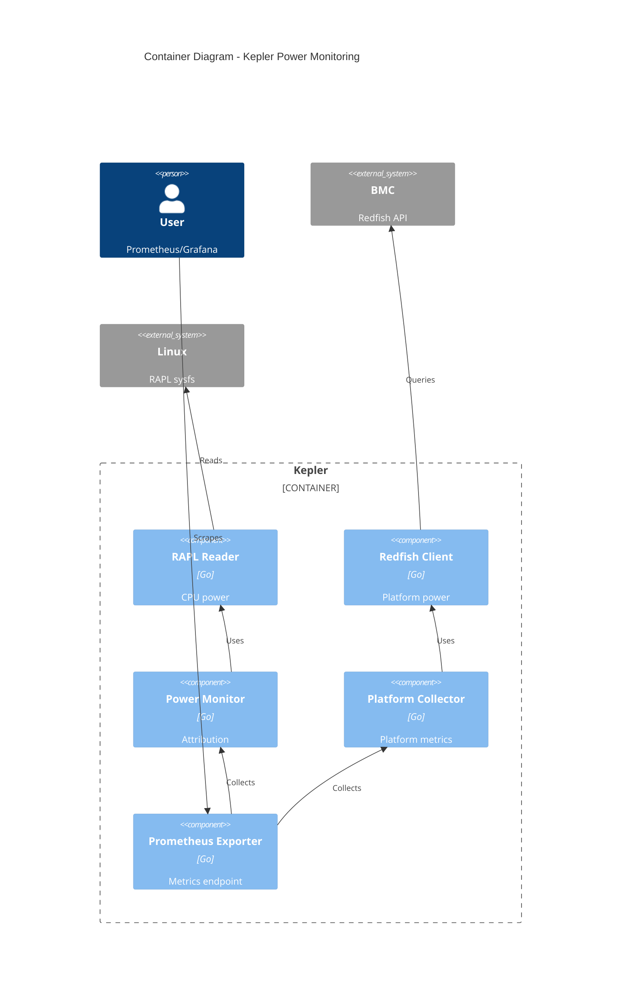
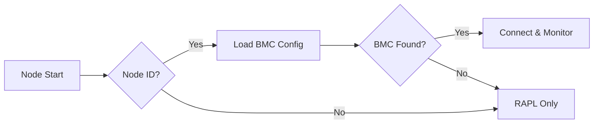
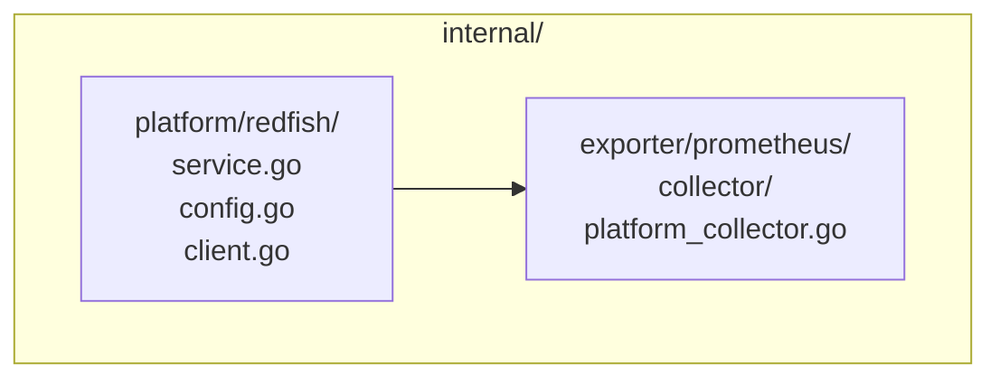

# EP-001: Redfish Power Monitoring Support

- **Status**: Draft
- **Author**: Sunil Thaha
- **Created**: 2025-08-14

## Summary

Add Redfish BMC power monitoring to Kepler for platform-level power consumption data,
complementing existing RAPL CPU monitoring to provide comprehensive server power
visibility.

## Problem

Kepler currently measures only CPU power via Intel RAPL, missing:

- Platform power (PSU, cooling, storage, network)
- Multi-vendor support (AMD, ARM systems)
- BMC integration capabilities already present in data centers

## Goals

- Add Redfish BMC power monitoring capability
- Support Kubernetes, bare metal, and standalone deployments
- Integrate with existing Kepler architecture
- Maintain security best practices

## Non-Goals

- Replace RAPL monitoring (complementary)
- Support non-Redfish protocols (IPMI) initially
- Implement power control features
- Advanced resilience patterns in v1

## Solution

Add platform service layer collecting BMC power data via Redfish, exposed through
Prometheus collectors separately from CPU power attribution.



## Node Identification

Nodes identified via `--platform.node-id` flag or `platform.nodeID` config,
matching identifiers in BMC configuration file.



## Implementation

### Package Structure



### Service Interfaces

Implements standard Kepler patterns:

- `service.Initializer`: Configuration and connection setup
- `service.Runner`: Periodic power collection with context
- `service.Shutdowner`: Clean resource release

### Configuration

**Kepler Config Structure:**

```go
type Platform struct {
    NodeID  string  `yaml:"nodeID"`
    Redfish Redfish `yaml:"redfish"`
}

type Redfish struct {
    Enabled    *bool  `yaml:"enabled"`
    ConfigFile string `yaml:"configFile"`
}
```

**CLI Flags:**

```bash
--platform.node-id=worker-1
--platform.redfish.enabled=true
--platform.redfish.config=/etc/kepler/redfish.yaml
```

**BMC Configuration (`/etc/kepler/redfish.yaml`):**

```yaml
nodes:
  worker-1: bmc-1
  worker-2: bmc-2

bmcs:
  bmc-1:
    endpoint: "https://192.168.1.100"
    username: "admin"
    password: "secret"
    insecure: true  # TLS verification

  bmc-2:
    endpoint: "https://192.168.1.101"
    username: "admin"
    password: "secret456"
    insecure: false               # Verify TLS certificates

  control-bmc:
    endpoint: "https://192.168.1.102"
    username: "root"
    password: "admin123"
    insecure: false
```

## Metrics

```prometheus
# New platform metrics
kepler_node_platform_watts{source="redfish",node_name="worker-1"} 450.5
kepler_node_platform_joules_total{source="redfish",node_name="worker-1"} 123456.789

# Existing CPU metrics unchanged
kepler_node_cpu_watts{zone="package",node_name="worker-1"} 125.2
```

## Error Handling

- Connection failures: Log and continue with RAPL-only
- Authentication errors: Retry once, then disable for node
- Timeouts: 30-second context timeout for BMC requests
- Graceful degradation when BMCs unavailable

## Security

- Credentials in Kubernetes secrets or secure files (mode 0600)
- No credential logging
- Require explicit opt-in via configuration

## Implementation Phases

1. **Foundation**: Dependencies, service structure, config parsing
2. **Core**: Gofish integration, power collection, service interface
3. **Metrics**: Platform collector, Prometheus registration
4. **Testing**: Unit, integration, multi-vendor validation
5. **Release**: Documentation, migration guides

## Testing Strategy

- Unit tests with mocked Redfish responses
- Integration tests with Redfish simulator
- Performance impact validation (<2% overhead target compared to base kepler)

## Migration

- **Backward Compatible**: No breaking changes, opt-in feature
- **Phased Rollout**: Test subset before full deployment
- **Rollback**: Disable via config flag, continues with RAPL-only

## Risks and Mitigations

| Risk | Mitigation |
|------|------------|
| BMC connectivity | Retry logic, graceful degradation |
| Vendor compatibility | Multi-vendor testing |
| Performance impact | <2% overhead validation |
| Security | Secure credential handling, TLS default |

## Success Metrics

- Platform metrics available on 95%+ nodes with BMCs
- <2% CPU/memory overhead
- <5% collection failure rate
- Successful deployment by ops teams

## Future Enhancements

- Circuit breaker patterns
- Exponential backoff strategies
- External secret integration
- Chassis sub-component power zones

## Open Questions

1. Multi-chassis server handling?
2. Sub-component power exposure (PSU, fans)?
